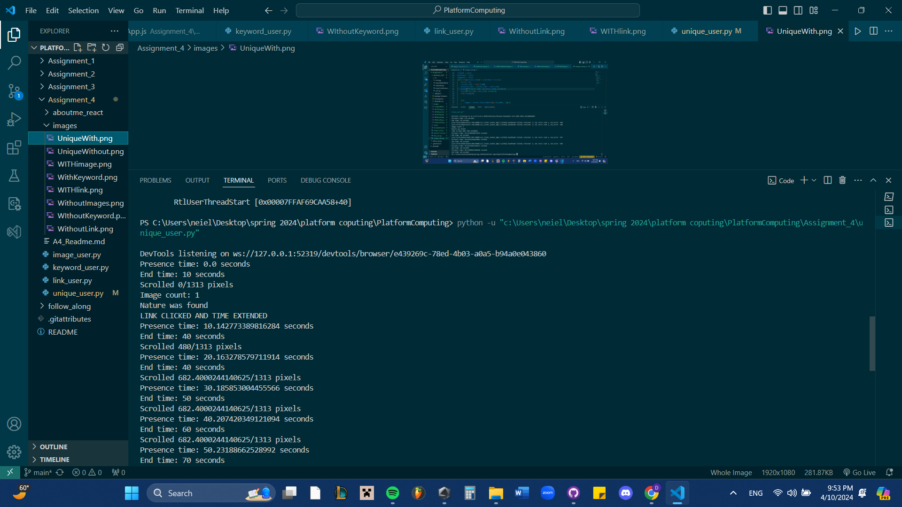
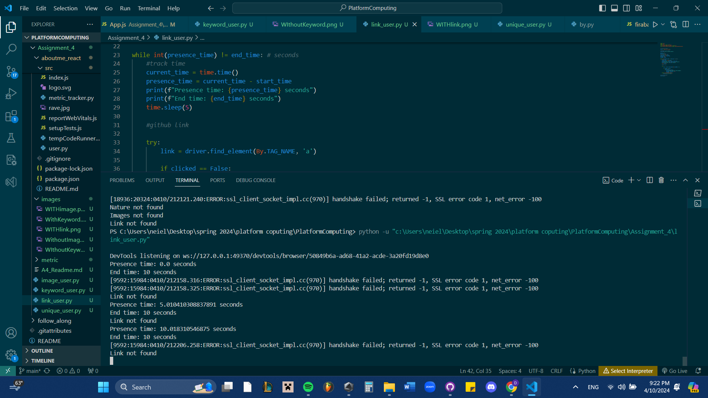

# Generate Users

This assignment had us work individually to simulate a user using selenium and its capabilities to simulate what a 
standard user would act like or would search for when accessing a website. In this example i used different 
methods in order to implement the requirements and had to use a try and except block in order for the
selenium script to complete even if the element was not found.

Time spent: **4** hours spent in total

## Features

The following **required** features are completed:

- [X] Organize Github folders (2 pts)
- [X] Create a user with affinity towards keyword(s) and verify that it works (3 pts)
- [X] Create a user with affinity towards image(s) and verify that it works (3 pts)
- [X] Create a user with affinity towards links and verify that it works (3 pts)
- [X] Describe a user with unique affinities (1 pt)
- [X] Create a user with unique affinities and verify that it works (3 pts)
The following **bonus** features are implemented:

- [ ] Create a unique user with an affinity OUTSIDE of keywords, images, or links (1.5 pt)
- [ ] Uploaded files for a unique user BOTH in javascript and python (1.5 pt)
- [ ] DESCRIBE ANY OTHER FEATURES HERE.

## Screenshot and/or Video Walkthrough

